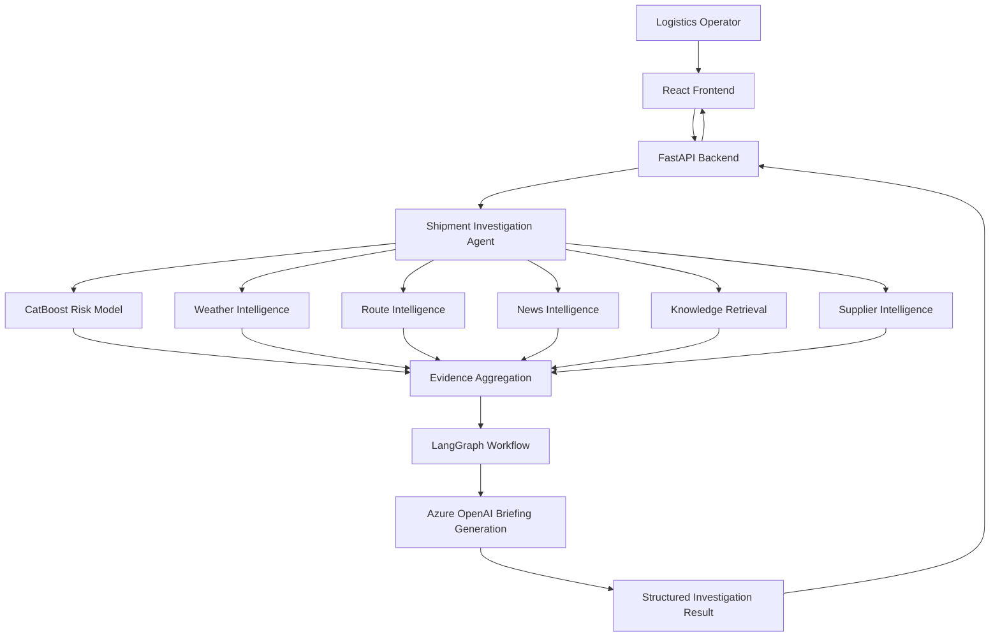

# SentinelAI
### AI-Powered Supply Chain Disruption Intelligence
This repository contains Team Accelerators' work for Project 3 of the TAG AI Engineering Bootcamp.

Team Members:
Yifieyeh Achesomie Goni
SOULEY Raquib
Tomoloju Temilolaoluwa

SentinelAI is an AI-powered supply chain intelligence platform that helps logistics teams identify shipment disruptions, assess operational risks, investigate contributing factors, and make evidence-based decisions.

By combining machine learning, external data sources, knowledge retrieval, and AI-generated analysis, SentinelAI transforms fragmented supply chain information into actionable operational intelligence while keeping final decisions in human hands.

## Overview

Supply chain disruptions can result from delivery delays, adverse weather, transportation constraints, and other operational uncertainties. Identifying these risks early requires analyzing information across multiple sources and understanding how they affect individual shipments.

SentinelAI brings these capabilities together in a unified interface. It evaluates shipment risk, gathers relevant contextual evidence, explores alternative routes where available, and generates structured briefings to support logistics operators.

## Key Features

- **Shipment Risk Prediction:** Uses a trained CatBoost machine learning model to estimate shipment delivery risk.
- **Operational Risk Assessment:** Combines shipment status and estimated arrival information to distinguish model predictions from the shipment's current operational condition.
- **Weather Intelligence:** Retrieves relevant weather information to provide environmental context for shipment assessments.
- **Route Intelligence:** Evaluates available route options using transportation routing data.
- **Disruption News Monitoring:** Retrieves relevant external news to help operators investigate potential disruption factors.
- **Knowledge-Base Retrieval:** Searches operational documents and procedures for relevant supporting guidance.
- **AI-Generated Briefings:** Produces structured summaries of risks, evidence, potential contributors, recommended human review, and uncertainties.
- **Supplier Intelligence:** Evaluates alternative supplier information when supporting data is available.
- **Human-in-the-Loop Decision Support:** Presents evidence and recommendations without automatically executing operational actions.

## Technology Stack

| Component | Technology |
|---|---|
| Backend API | Python, FastAPI |
| Machine Learning | CatBoost, pandas, scikit-learn |
| AI Integration | Azure OpenAI |
| Agent Orchestration | LangGraph |
| Retrieval-Augmented Generation | ChromaDB, embedding-based retrieval |
| Weather Data | Open-Meteo |
| Geocoding | OpenStreetMap Nominatim |
| Route Calculation | OSRM |
| News Intelligence | GDELT |
| Frontend | React, Vite, JavaScript |
| Testing | pytest, frontend build validation |

## System Architecture

SentinelAI uses a modular architecture that separates the user interface, API layer, risk prediction, intelligence gathering, and briefing generation.



### How It Works

1. **Shipment selection:** The operator selects a shipment for investigation.
2. **Risk estimation:** The machine learning model estimates the likelihood of delivery risk.
3. **Context gathering:** The system collects relevant weather, route, news, supplier, and knowledge-base information where available.
4. **Evidence aggregation:** Retrieved information is organized into a common investigation context.
5. **AI analysis:** The agent uses the supplied evidence to generate an operational briefing.
6. **Decision support:** The frontend presents risk indicators, evidence, recommendations, and uncertainties for human review.

## Project Structure

```text
c1-accelerators-project-3/
├── backend/          # FastAPI application and API routes
├── data/
│   ├── raw/          # Raw datasets
│   └── processed/    # Prepared datasets and derived data
├── docs/             # Project documentation
├── frontend/         # React and Vite application
├── intelligence/     # Risk modelling and AI intelligence services
├── scripts/          # Data preparation and utility scripts
├── tests/            # Automated tests
└── README.md
```

## Design Principles

- **Evidence-grounded analysis:** Findings and recommendations should be supported by available evidence.
- **Transparency:** Model estimates, retrieved evidence, and uncertainties should remain distinguishable.
- **Human oversight:** Operational decisions remain with authorized human operators.
- **Modularity:** Intelligence services can be developed, tested, and maintained independently.
- **Graceful handling of missing data:** The system should identify unavailable information rather than inventing facts.
- **Responsible AI:** External news and general operational guidance are contextual evidence, not automatic proof of a specific shipment's disruption.

## Intended Users

SentinelAI is designed for logistics operators, supply chain analysts, procurement teams, and operations managers who need a consolidated view of shipment risk and supporting evidence.

## Project Status

SentinelAI is being developed as an AI engineering project focused on machine learning, agent orchestration, external data integration, and explainable operational decision support.

## Disclaimer

SentinelAI provides decision-support information, not guaranteed delivery predictions or autonomous logistics decisions. Model outputs and external data may be incomplete or uncertain. Users should independently verify critical information before taking operational action.

